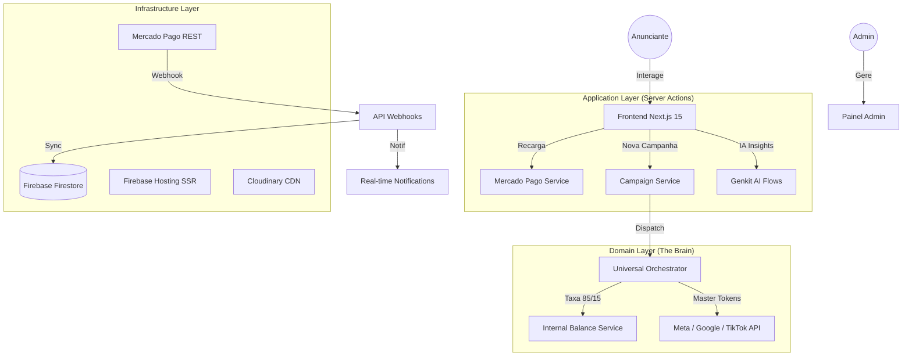

# ADS ORION — ARQUITETURA DE SISTEMA E GUIA DE AGENTES (v4.0 - Produção)

Este documento é a **"Fonte da Verdade"** definitiva para o ecossistema ADS Orion. Ele utiliza os padrões **Feature Layer**, **Clean Architecture** e **Spec-Driven Development (SDD)**.

---

## 📊 1. FLUXOGRAMA DE ORQUESTRAÇÃO GLOBAL

---

## 📁 2. MAPEAMENTO DE DIRETÓRIOS E RESPONSABILIDADES

### 🧩 `src/app/` (Application Layer)
*   **Objetivo**: Gerenciar rotas, estados de página e interações do usuário.
*   **Responsabilidades**: Renderização de UI, Proteção de rotas por Role, Chamadas de Server Actions.
*   **Submódulos**:
    *   `(auth)/`: Fluxos de autenticação e recuperação.
    *   `(dashboard)/user/`: Área operacional do anunciante.
    *   `(dashboard)/admin/`: Núcleo de comando estratégico e financeiro.
    *   `api/webhooks/`: Endpoints de recepção de eventos externos (Mercado Pago).
    *   `actions/`: Funções de servidor (`'use server'`) para processamento pesado e seguro.

### ⚙️ `src/services/` (Domain Layer)
*   **Objetivo**: Isolar a lógica de negócio das integrações externas.
*   **Responsabilidades**: Tradução de payloads, despacho de campanhas, cálculos de taxas.
*   **Componentes**:
    *   `universal-orchestrator.ts`: O cérebro que decide para onde e como enviar os anúncios.
    *   `meta/`, `google/`, `tiktok/`: Services especializados que consomem APIs oficiais via REST/SDK.

### 🤖 `src/ai/` (Intelligence Layer)
*   **Objetivo**: Prover inteligência generativa e analítica.
*   **Tecnologia**: Genkit + Gemini 2.5 Flash + Imagen 4.
*   **Fluxos**:
    *   `ai-ad-creative-assistant-flow.ts`: Geração de copy persuasiva.
    *   `ai-image-generator-flow.ts`: Criação de assets visuais para anúncios.
    *   `campaign-analysis-flow.ts`: Diagnóstico de ROI baseado em dados reais do Firestore.

### ⚛️ `src/components/` (UI Layer)
*   **Objetivo**: Componentes reutilizáveis e atômicos.
*   **Padrão**: ShadCN UI + Tailwind CSS.
*   **Especializados**:
    *   `notifications/`: Sino reativo e Modais de Prioridade (Broadcast).
    *   `charts/`: Abstrações de Recharts para visualização de performance.

### 🔥 `src/firebase/` (Infrastructure Layer)
*   **Objetivo**: Gerenciar a persistência e segurança dos dados.
*   **Responsabilidades**: Inicialização isomórfica (Cliente/Servidor), Hooks de dados em tempo real, Tratamento centralizado de erros de permissão.

---

## 🏗️ 3. ESPECIFICAÇÃO DE DADOS (FIRESTORE)

| Coleção | Documento | Finalidade | Campos Críticos |
| :--- | :--- | :--- | :--- |
| `/users/{uid}` | Documento | Perfil e Saldo Operacional | `balance` (Visual), `internalBalance` (Real), `role` |
| `/users/{uid}/notifications` | Subcoleção | Alertas em tempo real | `priority` (high/low), `read`, `type` |
| `/users/{uid}/transactions` | Subcoleção | Auditoria financeira | `amount`, `internalAmount` (85%), `status` |
| `/campaigns/{id}` | Documento | Dados da Orquestração | `budget`, `realBudget`, `platforms`, `metrics` |
| `/settings/mercadopago` | Documento | Credenciais de Produção | `environment`, `liveAccessToken`, `livePublicKey` |
| `/logs/{id}` | Documento | Auditoria Global Admin | `action`, `type` (critical/info), `details` |

---

## ⚖️ 4. REGRAS DE NEGÓCIO CRÍTICAS

1.  **Regra 85/15 (Poder de Mídia)**:
    *   O usuário vê e investe R$ 100.
    *   O sistema provisiona R$ 85 (`internalBalance`) para consumo real nas APIs.
    *   R$ 15 são retidos como taxa de orquestração e manutenção de IA.
2.  **Isolamento Estrito de Ambiente**:
    *   Se `settings/mercadopago.environment == "production"`, o sistema bloqueia automaticamente qualquer simulador de pagamento e exige chaves com prefixo `APP_USR-`.
3.  **Segurança de Escrita**:
    *   Nenhuma escrita no Firestore deve usar `await` direto no frontend para garantir persistência offline e UI fluida (Optimistic UI).
4.  **Casing de Roles**:
    *   As permissões de acesso devem sempre comparar a role em CAIXA ALTA (`ADMIN` / `USER`).

---

## 🚀 5. DIRETRIZES DE IMPLANTAÇÃO (FIREBASE HOSTING)

1.  **HTTPS Obrigatório**: Todas as integrações (OAuth, Webhooks) utilizam detecção dinâmica de domínio para garantir chamadas seguras.
2.  **Autorização de Server Actions**: O `next.config.ts` deve autorizar explicitamente os domínios `.web.app` e `.firebaseapp.com`.
3.  **Homologação MP**: Em produção, a conta vendedora deve estar homologada no Mercado Pago para evitar o erro de "Live Credentials".

---

## 🛠️ 6. CONVENÇÕES DE DESENVOLVIMENTO (SDD)

*   **Server Actions**: Use para toda lógica que envolva segredos (Tokens, APIs) ou mutações complexas no banco.
*   **Hydration Errors**: Operações que dependem do navegador (`window`, `localStorage`, `Date()`) devem ser executadas dentro de um `useEffect`.
*   **Error Handling**: Erros de permissão do Firestore devem ser emitidos via `errorEmitter` para disparar o `FirebaseErrorListener` global.
*   **Placeholders**: Imagens externas devem ser referenciadas em `src/lib/placeholder-images.json`.

---

© 2024-2026 ADS Orion — A Revolução da Publicidade Inteligente.
**Liderança:** Abel Santos (CEO) & Mitalo Ammon (CTO).
